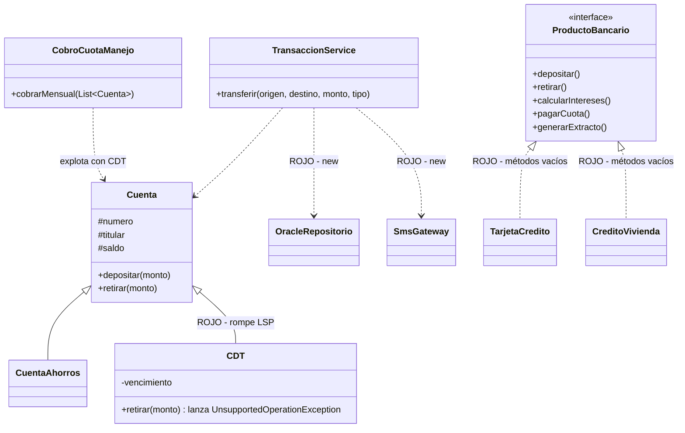

# UML del código original (Bloque 1.4)

Las flechas marcadas con `:::problema` y los comentarios indican lo problemático (en el diagrama a mano/draw.io se pintan en rojo).

```mermaid
classDiagram
    class Cuenta {
        #numero
        #titular
        #saldo
        +depositar(monto)
        +retirar(monto)
    }
    class CuentaAhorros
    class CDT {
        -vencimiento
        +retirar(monto) lanza UnsupportedOperationException
    }
    class TransaccionService {
        +transferir(origen, destino, monto, tipo)
    }
    class OracleRepositorio
    class SmsGateway
    class CobroCuotaManejo {
        +cobrarMensual(List~Cuenta~)
    }
    class ProductoBancario {
        <<interface>>
        +depositar()
        +retirar()
        +calcularIntereses()
        +pagarCuota()
        +generarExtracto()
    }
    class TarjetaCredito
    class CreditoVivienda

    Cuenta <|-- CuentaAhorros
    Cuenta <|-- CDT : ROJO - rompe LSP
    ProductoBancario <|.. TarjetaCredito : ROJO - métodos vacíos
    ProductoBancario <|.. CreditoVivienda : ROJO - métodos vacíos
    TransaccionService ..> OracleRepositorio : ROJO - new
    TransaccionService ..> SmsGateway : ROJO - new
    TransaccionService ..> Cuenta
    CobroCuotaManejo ..> Cuenta : explota con CDT
```
