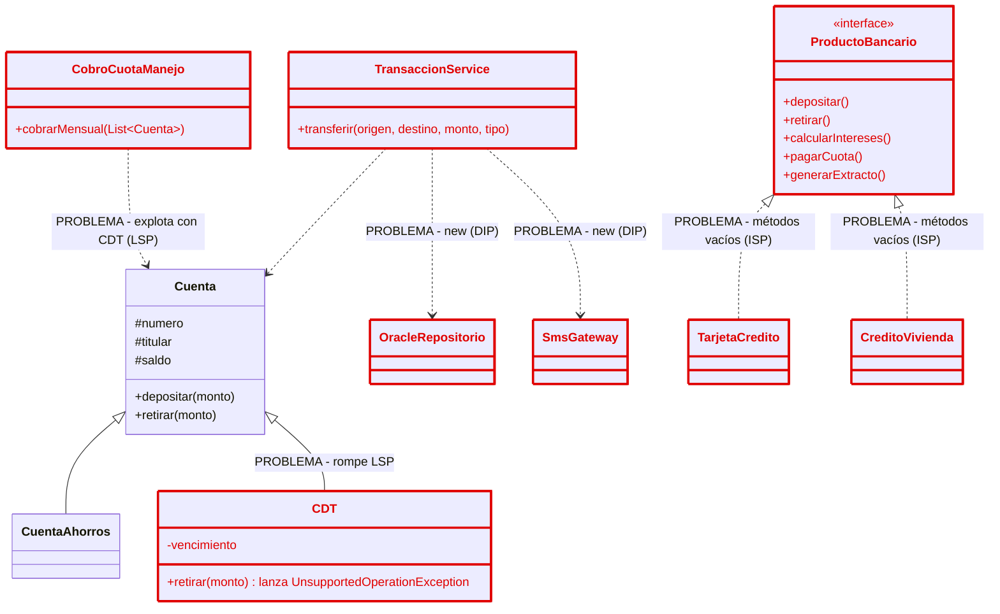

# UML del código original (Bloque 1.4)

En rojo: clases y relaciones problemáticas. Cada flecha problemática lleva además la etiqueta `PROBLEMA` con el principio que viola.

```mermaid
classDiagram
    class Cuenta {
        #numero
        #titular
        #saldo
        +depositar(monto)
        +retirar(monto)
    }
    class CuentaAhorros
    class CDT {
        -vencimiento
        +retirar(monto) lanza UnsupportedOperationException
    }
    class TransaccionService {
        +transferir(origen, destino, monto, tipo)
    }
    class OracleRepositorio
    class SmsGateway
    class CobroCuotaManejo {
        +cobrarMensual(List~Cuenta~)
    }
    class ProductoBancario {
        <<interface>>
        +depositar()
        +retirar()
        +calcularIntereses()
        +pagarCuota()
        +generarExtracto()
    }
    class TarjetaCredito
    class CreditoVivienda

    Cuenta <|-- CuentaAhorros
    Cuenta <|-- CDT : PROBLEMA - rompe LSP
    ProductoBancario <|.. TarjetaCredito : PROBLEMA - métodos vacíos (ISP)
    ProductoBancario <|.. CreditoVivienda : PROBLEMA - métodos vacíos (ISP)
    TransaccionService ..> OracleRepositorio : PROBLEMA - new (DIP)
    TransaccionService ..> SmsGateway : PROBLEMA - new (DIP)
    TransaccionService ..> Cuenta
    CobroCuotaManejo ..> Cuenta : PROBLEMA - explota con CDT (LSP)

    style CDT stroke:#e00000,stroke-width:3px,color:#e00000
    style TransaccionService stroke:#e00000,stroke-width:3px,color:#e00000
    style OracleRepositorio stroke:#e00000,stroke-width:3px,color:#e00000
    style SmsGateway stroke:#e00000,stroke-width:3px,color:#e00000
    style CobroCuotaManejo stroke:#e00000,stroke-width:3px,color:#e00000
    style ProductoBancario stroke:#e00000,stroke-width:3px,color:#e00000
    style TarjetaCredito stroke:#e00000,stroke-width:3px,color:#e00000
    style CreditoVivienda stroke:#e00000,stroke-width:3px,color:#e00000
```
