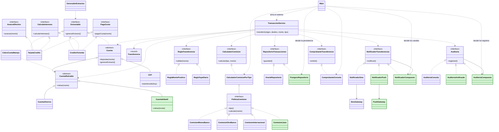

# UML del código final (Bloque 6.1)

Incluye la refactorización (bloque 2) y los requerimientos R1–R5 (bloque 4). Las clases nuevas del bloque 4 están en verde.

```mermaid
classDiagram
    class Extractable {
        <<interface>>
        +generarExtracto()
    }
    class Cuenta {
        <<abstract>>
        +depositar(monto)
        +generarExtracto()
    }
    class CuentaRetirable {
        <<abstract>>
        +retirar(monto)
    }
    class CuentaAhorros
    class CuentaInfantil {
        +retirar(monto)
    }
    class CDT {
        +estaVencido(hoy)
    }
    Extractable <|.. Cuenta
    Cuenta <|-- CuentaRetirable
    Cuenta <|-- CDT
    CuentaRetirable <|-- CuentaAhorros
    CuentaRetirable <|-- CuentaInfantil

    class CalculaIntereses {
        <<interface>>
        +calcularIntereses()
    }
    class PagaCuota {
        <<interface>>
        +pagarCuota(monto)
    }
    class AvanceEfectivo {
        <<interface>>
        +avanzar(monto)
    }
    class TarjetaCredito
    class CreditoVivienda
    Extractable <|.. TarjetaCredito
    AvanceEfectivo <|.. TarjetaCredito
    CalculaIntereses <|.. TarjetaCredito
    PagaCuota <|.. TarjetaCredito
    Extractable <|.. CreditoVivienda
    CalculaIntereses <|.. CreditoVivienda
    PagaCuota <|.. CreditoVivienda
    class GeneradorExtractos
    GeneradorExtractos ..> Extractable
    class CobroCuotaManejo
    CobroCuotaManejo ..> CuentaRetirable

    class TransaccionService {
        +transferir(origen, destino, monto, tipo)
    }
    class Transferencia {
        <<record>>
    }
    class ReglaTransferencia {
        <<interface>>
        +validar(monto)
    }
    class CalculadorComision {
        <<interface>>
        +calcular(tipo, monto)
    }
    class PoliticaComision {
        <<interface>>
        +tipo()
        +calcular(monto)
    }
    class RepositorioTransacciones {
        <<interface>>
        +guardar(t)
    }
    class ComprobanteTransferencia {
        <<interface>>
        +emitir(t)
    }
    class NotificadorTransferencias {
        <<interface>>
        +notificar(t)
    }
    class Auditoria {
        <<interface>>
        +registrar(t)
    }
    TransaccionService ..> ReglaTransferencia
    TransaccionService ..> CalculadorComision
    TransaccionService ..> RepositorioTransacciones
    TransaccionService ..> ComprobanteTransferencia
    TransaccionService ..> NotificadorTransferencias
    TransaccionService ..> Auditoria
    TransaccionService ..> CuentaRetirable
    TransaccionService ..> Cuenta
    TransaccionService ..> Transferencia
    ReglaTransferencia <|.. ReglaMontoPositivo
    ReglaTransferencia <|.. ReglaTopeDiario
    CalculadorComision <|.. CalculadorComisionPorTipo
    CalculadorComisionPorTipo o-- PoliticaComision
    PoliticaComision <|.. ComisionMismoBanco
    PoliticaComision <|.. ComisionOtroBanco
    PoliticaComision <|.. ComisionInternacional
    PoliticaComision <|.. ComisionLlave
    RepositorioTransacciones <|.. OracleRepositorio
    RepositorioTransacciones <|.. PostgresRepositorio
    ComprobanteTransferencia <|.. ComprobanteConsola
    NotificadorTransferencias <|.. NotificadorSms
    NotificadorSms --> SmsGateway
    NotificadorTransferencias <|.. NotificadorPush
    NotificadorPush --> PushGateway
    NotificadorTransferencias <|.. NotificadorCompuesto
    NotificadorCompuesto o-- NotificadorTransferencias
    Auditoria <|.. AuditoriaConsola
    Auditoria <|.. AuditoriaAntifraude
    Auditoria <|.. AuditoriaCompuesta
    AuditoriaCompuesta o-- Auditoria

    class Main
    Main ..> TransaccionService : arma el sistema
    Main ..> PostgresRepositorio : decide la persistencia
    Main ..> NotificadorCompuesto : decide los canales
    Main ..> AuditoriaCompuesta : decide los registros
    Main ..> ComprobanteConsola
    Main ..> CalculadorComisionPorTipo

    class ComisionLlave
    class PostgresRepositorio
    class PushGateway
    class NotificadorPush
    class NotificadorCompuesto
    class AuditoriaAntifraude
    class AuditoriaCompuesta

    style CuentaInfantil fill:#d8f5d8,stroke:#2a8a2a
    style ComisionLlave fill:#d8f5d8,stroke:#2a8a2a
    style PostgresRepositorio fill:#d8f5d8,stroke:#2a8a2a
    style PushGateway fill:#d8f5d8,stroke:#2a8a2a
    style NotificadorPush fill:#d8f5d8,stroke:#2a8a2a
    style NotificadorCompuesto fill:#d8f5d8,stroke:#2a8a2a
    style AuditoriaAntifraude fill:#d8f5d8,stroke:#2a8a2a
    style AuditoriaCompuesta fill:#d8f5d8,stroke:#2a8a2a
```
