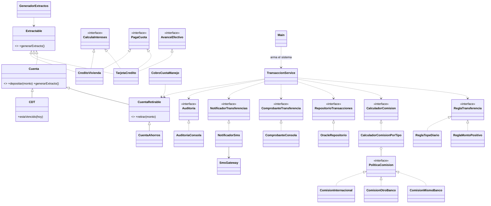

# UML del código final (Bloque 6.1)

```mermaid
classDiagram
    class Extractable { <<interface>> +generarExtracto() }
    class Cuenta { <<abstract>> +depositar(monto) +generarExtracto() }
    class CuentaRetirable { <<abstract>> +retirar(monto) }
    class CuentaAhorros
    class CDT { +estaVencido(hoy) }
    Extractable <|.. Cuenta
    Cuenta <|-- CuentaRetirable
    Cuenta <|-- CDT
    CuentaRetirable <|-- CuentaAhorros

    class CalculaIntereses { <<interface>> }
    class PagaCuota { <<interface>> }
    class AvanceEfectivo { <<interface>> }
    class TarjetaCredito
    class CreditoVivienda
    Extractable <|.. TarjetaCredito
    AvanceEfectivo <|.. TarjetaCredito
    CalculaIntereses <|.. TarjetaCredito
    PagaCuota <|.. TarjetaCredito
    Extractable <|.. CreditoVivienda
    CalculaIntereses <|.. CreditoVivienda
    PagaCuota <|.. CreditoVivienda
    class GeneradorExtractos
    GeneradorExtractos ..> Extractable
    class CobroCuotaManejo
    CobroCuotaManejo ..> CuentaRetirable

    class TransaccionService
    class ReglaTransferencia { <<interface>> }
    class CalculadorComision { <<interface>> }
    class RepositorioTransacciones { <<interface>> }
    class ComprobanteTransferencia { <<interface>> }
    class NotificadorTransferencias { <<interface>> }
    class Auditoria { <<interface>> }
    class PoliticaComision { <<interface>> }
    TransaccionService ..> ReglaTransferencia
    TransaccionService ..> CalculadorComision
    TransaccionService ..> RepositorioTransacciones
    TransaccionService ..> ComprobanteTransferencia
    TransaccionService ..> NotificadorTransferencias
    TransaccionService ..> Auditoria
    TransaccionService ..> CuentaRetirable
    ReglaTransferencia <|.. ReglaMontoPositivo
    ReglaTransferencia <|.. ReglaTopeDiario
    CalculadorComision <|.. CalculadorComisionPorTipo
    CalculadorComisionPorTipo o-- PoliticaComision
    PoliticaComision <|.. ComisionMismoBanco
    PoliticaComision <|.. ComisionOtroBanco
    PoliticaComision <|.. ComisionInternacional
    RepositorioTransacciones <|.. OracleRepositorio
    ComprobanteTransferencia <|.. ComprobanteConsola
    NotificadorTransferencias <|.. NotificadorSms
    NotificadorSms --> SmsGateway
    Auditoria <|.. AuditoriaConsola
    class Main
    Main ..> TransaccionService : arma el sistema
```
